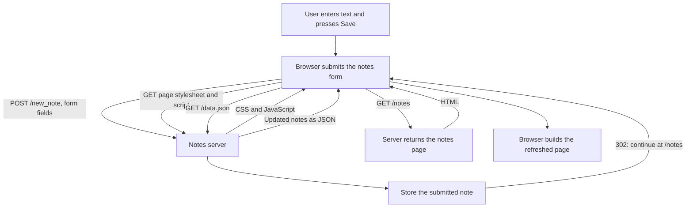
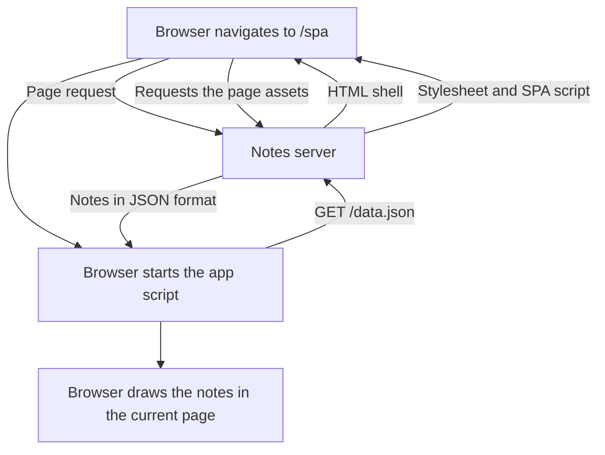
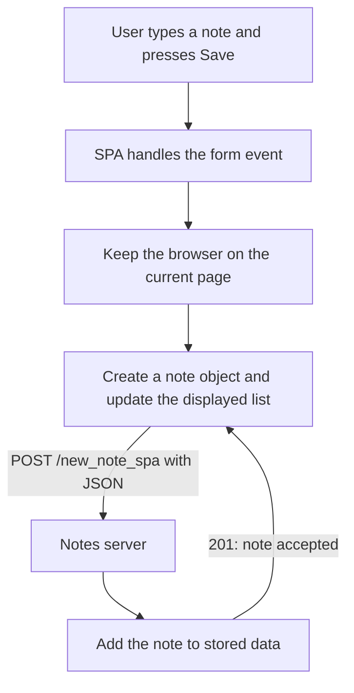

# Part 0: request-flow diagrams

## 0.4: Saving a note in the traditional app

```mermaid
flowchart TD
    A[User enters text and presses Save] --> B[Browser submits the notes form]
    B -->|POST /new_note, form fields| C[Notes server]
    C --> D[Store the submitted note]
    D -->|302: continue at /notes| B
    B -->|GET /notes| E[Server returns the notes page]
    E -->|HTML| B
    B -->|GET page stylesheet and script| C
    C -->|CSS and JavaScript| B
    B -->|GET /data.json| C
    C -->|Updated notes as JSON| B
    B --> F[Browser builds the refreshed page]
```

## 0.5: Opening the single-page notes app

```mermaid
flowchart TD
    A[Browser navigates to /spa] -->|Page request| B[Notes server]
    B -->|HTML shell| A
    A -->|Requests the page assets| B
    B -->|Stylesheet and SPA script| A
    A --> C[Browser starts the app script]
    C -->|GET /data.json| B
    B -->|Notes in JSON format| C
    C --> D[Browser draws the notes in the current page]
```

## 0.6: Saving a note in the single-page app

```mermaid
flowchart TD
    A[User types a note and presses Save] --> B[SPA handles the form event]
    B --> C[Keep the browser on the current page]
    C --> D[Create a note object and update the displayed list]
    D -->|POST /new_note_spa with JSON| E[Notes server]
    E --> F[Add the note to stored data]
    F -->|201: note accepted| D
```